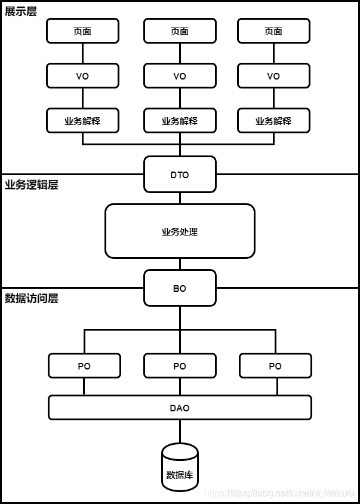

# api
```
# 文件结构：
|-pojo      # 类模型名称通常
  |-bean    # 逻辑bean
  |-bo      # 业务层和数据层转换数据
  |-dao     # 数据对象
  |-dto     # 数据传输对象
  |-vo      # 展示对象
```
## 1.类模型命名规范


领域模型命名规约：
- 1）数据对象：xxxDAO，xxx 即为数据表名。
- 2）数据传输对象：xxxDTO，xxx 为业务领域相关的名称。
- 3）展示对象：xxxVO，xxx 一般为网页名称。
- 4）POJO 是 DAO / DTO / BO / VO 的统称，禁止命名成 xxxPOJO。

